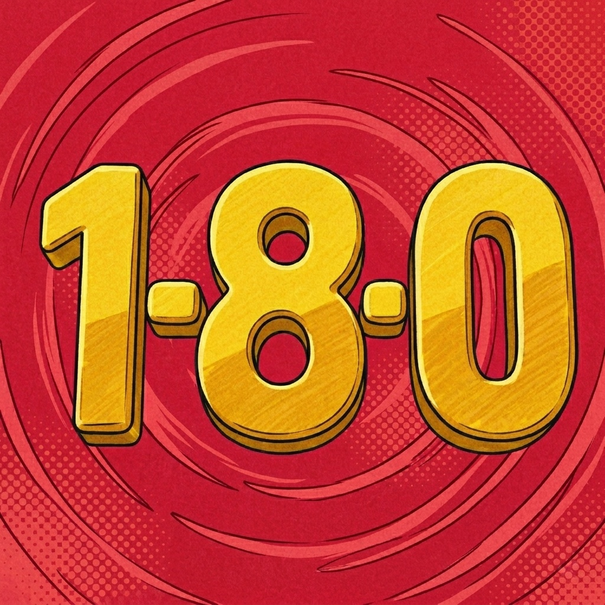

<p align="center">
  
</p>

<h1 align="center">Confused Creature</h1>
<p align="center"><em>Custom anime extensions for the Aniyomi app and its forks.</em></p>

<p align="center">
  <a href="https://confused-creature-180.github.io/aniyomi-extensions/add-repo.html">
    
  </a>
  <a href="https://discord.gg/vbkPKEQvGb">
    
  </a>
  <a href="https://confused-creature-180.github.io/aniyomi-extensions/">
    
  </a>
  <a href="LICENSE">
    
  </a>
</p>

<p align="center">
  <a href="https://github.com/Confused-Creature-180/aniyomi-extensions/releases">
    
  </a>
  
  
  
  <br />
  
  
  
</p>

---

## ✨ What is this?

This repository hosts **AniKoto 180** — a free, open-source Aniyomi extension that lets the [Aniyomi](https://github.com/aniyomiorg/aniyomi) app (and its forks) browse and stream anime from `anikototv.to`.

- **Self-sustained** — no backend server, runs entirely on-device.
- **Multi-server video pipeline** — VidCloud-1, VidPlay-1, Vidstream-2, HD-1, Kiwi-Stream.
- **Episode metadata enrichment** — thumbnails, titles, and descriptions pulled from multiple community databases.
- **AI-powered Smart Search** — describe an anime in plain English (or misspell it) and let Google AI Search resolve it to the right title.
- **Light/dark Pages site** with scroll animations and one-tap repo install.

> **Current release:** AniKoto 180 v16.9 (versionCode 9) · [Source ID `178825880993122333`](https://raw.githubusercontent.com/Confused-Creature-180/aniyomi-extensions/repo/index.min.json)

---

## 🚀 Quick Start

### Add the repo to Aniyomi

**Option 1 — One Tap:** Tap the **Add to Aniyomi** badge above **on your Android phone**. Aniyomi opens and prompts you to add the repo.

**Option 2 — Manual:**

1. Open **Aniyomi** on your phone
2. Go to **Settings → Extensions** (puzzle icon)
3. Tap **≡ → Manage extension repos → +** (Add repo)
4. Paste this URL:

```
https://raw.githubusercontent.com/Confused-Creature-180/aniyomi-extensions/repo/index.min.json
```

5. **Confirm** → browse extensions under their language section → **Install**

### ⚠️ Upgrading from v16.5 (or earlier)

The package name changed from `…anikoto` to `…anikoto180` in v16.9. Android treats different package names as different apps, so a direct in-place update is **not possible**:

1. **Uninstall** the old AniKoto extension first.
2. Refresh the repo in Aniyomi.
3. **Install** the new AniKoto 180 (v16.9).

The signing key, source ID, and source name are unchanged — so once the new package is installed, your saved anime continue to load from the same source.

### Download the APK directly

Prefer to sideload? Grab the latest signed release APK from the [`apk/` folder](apk/) or the [Releases page](https://github.com/Confused-Creature-180/aniyomi-extensions/releases).

---

## 📂 Repository Structure

```
aniyomi-extensions/
├── apk/          ← Pre-built signed release APK(s) for direct download
├── assets/       ← Banner + promotional images
├── dev/          ← Full extension source code (Gradle project)
│   ├── common/   ← Shared AndroidManifest + ProGuard rules
│   ├── gradle/   ← Version catalogs + Gradle wrapper
│   ├── stubs/    ← ext-lib v16 compile-only stubs (NOT in the APK)
│   └── src/en/anikoto/   ← The AniKoto extension module
├── docs/         ← GitHub Pages site (5 pages, light/dark, animations)
├── LICENSE       ← Apache 2.0
└── README.md     ← You are here
```

| Branch | Purpose |
|--------|---------|
| `main` | Source code, README, APKs, and the GitHub Pages site (in `/docs`) |
| `repo` | Published artifacts for Aniyomi — `index.min.json`, `index.json`, `repo.json`, `apk/`, `icon/` (orphan commits, no shared history) |

> The `repo` branch is auto-generated and contains **only** published artifacts. If GitHub shows a "Compare & pull request" banner for the `repo` branch, **dismiss it** — it is not a PR target.

---

## 💚 Credits & Data Sources

AniKoto 180 stands on the shoulders of several community databases and open-source projects. **This extension would be a much poorer experience without them.** Go give them a star.

### Episode metadata

The episode **thumbnails**, **titles**, and **descriptions** shown in your library are enriched from these sources (in priority order, with graceful fallback):

| Data | Source | What it provides |
|------|--------|------------------|
| **Episode thumbnails / cover images** | [Anikage.cc](https://anikage.cc) · [AniList](https://anilist.co) · [Kitsu](https://kitsu.app) | Per-episode thumbnail images, banner art, streaming-episode screenshots |
| **Episode titles** | [Jikan (MyAnimeList)](https://jikan.moe) · [Anikage.cc](https://anikage.cc) · [Kitsu](https://kitsu.app) | English episode titles ("EP 1 — The Boy in the Iceberg") |
| **Episode descriptions / synopsis** | [Anikage.cc](https://anikage.cc) · [Kitsu](https://kitsu.app) | Short episode synopses |

### Smart Search

The **Smart Search** feature (toggleable in extension settings) resolves descriptive queries ("*the anime with a russian girl*") and misspellings ("*narutp*") to the correct anime title using **[Google AI Search](https://www.google.com/search?udm=50)**.

### Reference repositories

The structure and tooling of this repo were informed by these excellent Aniyomi extension repositories:

- **[aniyomiorg/aniyomi-extensions](https://github.com/aniyomiorg/aniyomi-extensions)** — the official Aniyomi extension index. The canonical schema for `index.min.json`, the Gradle build pattern, and the `repo` branch publishing flow all originate here.
- **[yuzono/anime-extensions](https://github.com/yuzono/anime-extensions)** — an advanced fork demonstrating precompiled Kotlin plugins, included builds, and smart incremental CI.
- **[salmanbappi/aniyomi-extensions](https://github.com/salmanbappi/aniyomi-extensions)** — a hybrid repo (official build + yuzono scripts) that informed our direct-APK hosting decision.
- **[aniyomiorg/aniyomi](https://github.com/aniyomiorg/aniyomi)** — the Aniyomi app itself, which loads and runs the extensions published here.

---

## 🍀 The Curse of the Uncredited Fork

> *Listen closely, dear forker.*

AniKoto 180 is **free and open source** under the Apache 2.0 license. You are welcome — **encouraged, even** — to study it, fork it, learn from it, and build on it.

**But.**

If you lift this extension's **episode metadata pipeline**, its **Smart Search**, its **episode thumbnails / titles / descriptions** logic, or any of its other neat tricks into your own project, and you **don't credit** the data sources (Anikage, AniList, Kitsu, Jikan, Google AI Search) and this repo…

…then **you shall be visited by one full year of remarkably specific bad luck.**

You will:

- 🦶 Stub your smallest toe on the **same table corner**. Three times in one week. The table hasn't moved. You have.
- 📄 Get a **paper cut** on the one finger you actually use to scroll. It will sting every time you unlock your phone.
- 🔌 Drop your charger **plug-first** onto the floor every single night, and it will always land prongs-up.
- 🥟 Bite into a dumpling expecting meat and get **a single, raw garlic clove** instead. Repeatedly.
- 🧦 Lose **exactly one sock** from every pair. The other sock remains, pristine and lonely, forever.
- 🪫 Watch your phone hit **1%** the *instant* you need it most, despite having just unplugged it at 83%.
- 📦 Receive a package, open it eagerly, and find it is **your own item, returned to you**, with a note that says "this fell out of the box."
- 🪑 Pull out a chair to sit down, and the floor will have shifted by exactly **two inches** since you last sat there.

The curse **does not lift** until you add a visible credit line in your README (or your extension's about page) pointing back to:

- `https://github.com/Confused-Creature-180/aniyomi-extensions`
- Anikage, AniList, Kitsu, Jikan, and Google AI Search

It's a small price. The garlic clove alone isn't worth it. 🥲

*Jokes aside — please be kind to the open-source community that made this possible. Credit where credit is due. 💚*

---

## 📜 License & Free Use

This project is licensed under the **[Apache License 2.0](LICENSE)**.

In plain English:

- ✅ **You are free to use** this extension, personally or commercially.
- ✅ **You are free to study** the source code, fork it, and modify it.
- ✅ **You are free to distribute** copies or modified versions.
- ✅ **You are free to** grant these same rights to others.
- ⚠️ You must **retain the license + copyright notice** in any redistribution.
- ⚠️ You must **state your changes** in modified files.
- ⚠️ You must **credit the data sources** listed above if you reuse the metadata pipeline or Smart Search logic (see *The Curse of the Uncredited Fork* — it's mostly a joke, but the credit part is serious).

> *The `anikoto-release.jks` signing keystore is **NOT** covered by this license and is **not** included in this repository. It remains the private property of the maintainer. Only APKs signed with that keystore can update in place as "AniKoto 180" — fork builds must use a different package name and signing identity.*

---

## 🌐 Website

The **[GitHub Pages site](https://confused-creature-180.github.io/aniyomi-extensions/)** includes:

- **[Home](https://confused-creature-180.github.io/aniyomi-extensions/)** — Landing page with featured extensions and quick install
- **[Extensions](https://confused-creature-180.github.io/aniyomi-extensions/extensions.html)** — Browse all extensions, view metadata, download APKs
- **[Guides](https://confused-creature-180.github.io/aniyomi-extensions/guides.html)** — Step-by-step tutorials (install Aniyomi, add repos, install extensions, updates, troubleshooting, FAQ)
- **[Add Repo](https://confused-creature-180.github.io/aniyomi-extensions/add-repo.html)** — One-tap deep link to add this repo to Aniyomi
- **[Disclaimer](https://confused-creature-180.github.io/aniyomi-extensions/disclaimer.html)** — Full legal notice

The site features **light and dark mode** (follows your system preference, with a manual toggle), scroll-triggered animations, and dynamically loads the extension list from `index.min.json` so it always shows the latest extensions.

---

## 🛠️ Building from Source

The extension is a standard Gradle project. See **[`dev/README.md`](dev/README.md)** for full build instructions, environment setup, and signing configuration.

Quick version:

```bash
cd dev
./gradlew :src:en:anikoto:assembleRelease
# → src/en/anikoto/build/outputs/apk/release/aniyomi-en.anikoto180-v16.9-release.apk
```

> Without the maintainer's signing keystore (which is **not** in this repo), a release build will fall back to your local debug signing key. The APK will install and run, but will **not** be installable as an update to the official AniKoto 180 — it will appear as a separate app.

---

## ⚖️ Disclaimer

This repository **does not host any anime, manga, or video content**. It only provides Aniyomi extensions — plugins that allow the Aniyomi app to interface with third-party streaming websites.

- **No affiliation** with Aniyomi, the Aniyomi development team, Anikage, AniList, Kitsu, Jikan, Google, or any scraped websites.
- Extensions are provided "as is" for **personal, non-commercial use** only.
- Users are responsible for complying with their **local laws** and the **terms of service** of accessed websites.
- Extensions are provided **without warranty**. Functionality may break if scraped websites change.
- For takedown requests, please **[open an issue](https://github.com/Confused-Creature-180/aniyomi-extensions/issues)**.

> **[Read the full disclaimer →](https://confused-creature-180.github.io/aniyomi-extensions/disclaimer.html)**

---

## 🔗 Links

| | |
|---|---|
| **Website** | [confused-creature-180.github.io/aniyomi-extensions](https://confused-creature-180.github.io/aniyomi-extensions/) |
| **Extensions** | [Browse & Download](https://confused-creature-180.github.io/aniyomi-extensions/extensions.html) |
| **Guides** | [Tutorials & FAQ](https://confused-creature-180.github.io/aniyomi-extensions/guides.html) |
| **Releases** | [GitHub Releases](https://github.com/Confused-Creature-180/aniyomi-extensions/releases) |
| **Discord** | [discord.gg/vbkPKEQvGb](https://discord.gg/vbkPKEQvGb) |
| **Aniyomi App** | [github.com/aniyomiorg/aniyomi](https://github.com/aniyomiorg/aniyomi) |
| **License** | [Apache 2.0](LICENSE) |
| **Issues** | [Report a bug / Request a feature](https://github.com/Confused-Creature-180/aniyomi-extensions/issues) |

---

<p align="center">
  <em>© 2026 Confused-Creature-180 · Licensed under <a href="LICENSE">Apache 2.0</a></em>
  <br />
  <em>Made with 💚 for the Aniyomi community.</em>
</p>
